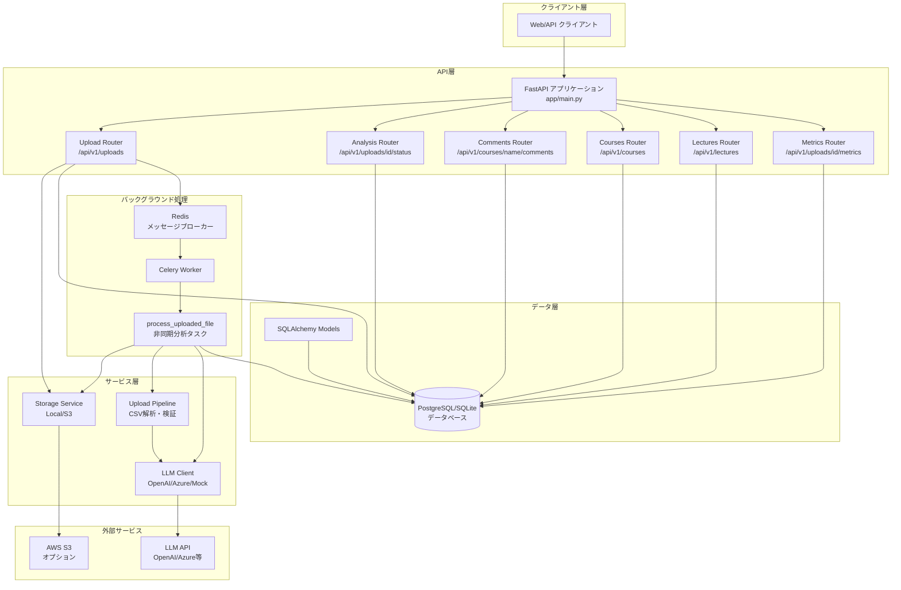
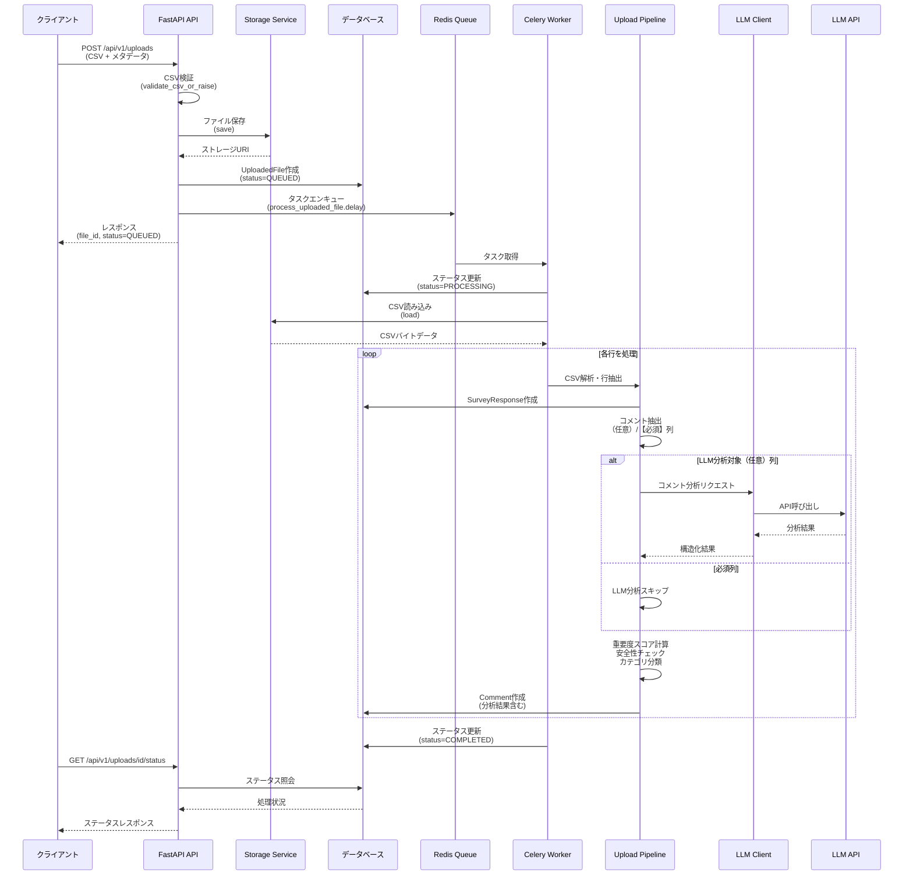

# AIE-DXプロジェクト１（バックエンド）

FastAPIで構築されたAIE-DXprojectイニシアティブのバックエンドサービス。

## クイックスタート

```bash
docker compose up --build
```

http://localhost:8000/docs にアクセスしてインタラクティブなAPIドキュメントを探索してください。スタックを停止するには `docker compose down` を使用してください。

## 開発ワークフロー

- 環境固有のシークレットはローカルの `.env` ファイルに保存してください。
- 要件が変更された際は `docker compose up --build` を実行して依存関係を再ビルドしてください。
- 変更をプッシュする前に `pytest`（コンテナ内または仮想環境内）を実行してテストを実行してください。
- インフラの変更は `infra/README.md` を参照し、AWS CDK を使って管理してください。

## 設定・機密情報管理

Pydantic Settings（`app/core/settings.py`）を使ってアプリ構成値と機密情報を一元管理しています。`.env` に記述した値は自動的にロードされ、`AppSettings` 経由でFastAPIや各サービスに渡されます。

- `DATABASE_URL`: RDBの接続情報。未設定の場合はローカル用のSQLiteにフォールバックします。
- `AWS_ACCESS_KEY_ID`, `AWS_SECRET_ACCESS_KEY`, `AWS_SESSION_TOKEN`, `AWS_REGION`: AWS SDKやCDKが利用する認証情報。
- `LLM_*`: LLM連携に必要な各種パラメータ（詳細は後述）。
- `UPLOAD_BACKEND`, `UPLOAD_S3_BUCKET`, `UPLOAD_BASE_PREFIX`, `UPLOAD_LOCAL_DIRECTORY`: アップロード済みCSVの保存先を制御します。デフォルトはローカルディスク（`local`）に保存し、`s3` を指定するとS3アップロードが有効になります。

### データベースマイグレーション（Alembic）

SQLAlchemyモデルの変更は Alembic を使って管理します。初回セットアップまたはスキーマ更新時は以下を実行してください。

```bash
alembic upgrade head
```

差分からマイグレーションスクリプトを生成する場合は `alembic revision --autogenerate -m "message"` を使用します。生成後は内容を確認し、バージョン管理にコミットしてください。

`.env` はリポジトリにコミットしないでください（`.gitignore` で除外済み）。共有が必要な場合は、本READMEの環境変数一覧を参考に各自の環境で `.env` を作成してください。

## LLM 連携設定

コメント分析には任意のLLM APIを利用できます。`LLM_PROVIDER` を `mock`（デフォルト）、`openai`、`azure_openai`、`generic` から選択し、必要に応じて以下の環境変数を `.env` へ設定してください。

- `LLM_API_BASE`: APIエンドポイントのベースURL（`mock`以外では必須）
- `LLM_MODEL`: 使用するモデル名
- `LLM_API_KEY`: 認証に使用するAPIキー（必要な場合）
- `LLM_API_VERSION`: Azure OpenAI利用時のAPIバージョン
- `LLM_TIMEOUT_SECONDS`: タイムアウト秒数（デフォルト15秒）
- `LLM_REQUEST_TEMPLATE`: LLMに与えるプロンプトをカスタマイズしたい場合に設定
- `LLM_EXTRA_HEADERS`: 追加ヘッダーをJSON文字列で指定

`mock` モードでは外部通信を行わず、テスト用の固定レスポンスを返します。`openai` / `azure_openai` を利用する場合は、必ず `LLM_API_BASE` や認証情報を設定してください。また、本リリースで `comment` テーブルに `llm_importance_level` / `llm_importance_score` / `llm_risk_level` カラムを追加したため、既存DBを利用する場合はマイグレーションを適用する必要があります。アプリケーション起動時に不足している列は自動で `ALTER TABLE` により追加されます。

## プロジェクト構造

```
.
├── app/                     # FastAPIアプリケーションパッケージ
│   ├── __init__.py          # app, create_app を公開
│   └── main.py              # FastAPI本体とルート定義
├── tests/                   # アプリ用ユニットテスト
│   ├── test_health.py       # ヘルスチェックエンドポイントのテスト
│   ├── test_llm_client.py   # LLMクライアントのテスト
│   ├── test_migrations.py   # マイグレーションユーティリティの検証
│   ├── test_settings.py     # 設定読み込みの検証
│   └── test_storage.py      # アップロードストレージの検証
├── alembic/                 # Alembic 設定とマイグレーションスクリプト
│   ├── env.py               # マイグレーション実行時の設定
│   └── versions/            # 生成されたマイグレーションファイル
├── infra/                   # AWS CDK によるインフラコード
│   ├── app.py               # CDKエントリーポイント
│   ├── README.md            # インフラ運用手順
│   ├── requirements.txt     # CDK依存パッケージ
│   ├── cdk.json             # CDKアプリの設定
│   ├── cdk.context.json     # デプロイ時に保存されたコンテキスト
│   ├── cdk.out/             # CDK synth 後の生成物（Git管理外推奨）
│   ├── stacks/              # スタック定義
│   │   ├── backend_stack.py       # ECS Fargate本番スタック
│   │   └── github_oidc_role_stack.py # GitHub Actions用IAMロール
│   └── tests/               # CDKスタックの検証テスト
│       └── test_synth.py    # テンプレート生成テスト
├── Dockerfile               # 本番/ローカル用ビルドレシピ
├── docker-compose.yml       # ローカル開発用コンテナ起動設定
├── requirements.txt         # アプリケーション依存パッケージ
├── requirements-dev.txt     # 開発・テスト用依存パッケージ
├── pyproject.toml           # フォーマッタ/pytest 設定
└── .gitignore               # Git 管理対象から除外する項目
```

ローカル開発用の仮想環境 `.venv/` や CDK 実行時に生成される `infra/cdk.out/` などは Git 管理対象外です。

## システムアーキテクチャ

### 全体構成図

注: Mermaidの制約により、図中のパスパラメータ表記は {id}/{name} ではなく id/name としています（実際のAPIはパスパラメータを使用）。



### データフロー図（アップロード・分析フロー）



### コンポーネント依存関係図


## コントリビューション

1. フィーチャーブランチを作成してください。
2. Blackとisortでコードをフォーマットしてください（`black . && isort .`）。
3. `pytest`を実行してください。
4. mainブランチへのプルリクエストを開いてください。

## CI/CD

- 現在、このリポジトリには GitHub Actions のワークフローは同梱していません。
- CI を導入する場合は、最低限 black / isort / pytest の実行を含むジョブを作成し、必要に応じて ECR へのビルド/プッシュや CDK デプロイを追加してください（`infra/README.md` 参照）。
- GitHub OIDC 連携や ECR/ECS の権限設計は、利用する環境に合わせて構成してください。
