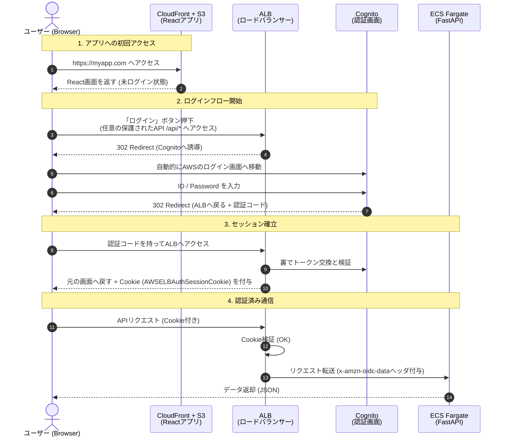

# ALB + Cognito 認証フロー

## シーケンス図



## フェーズ1：認証（ログインして鍵をもらう）

AWSのインフラ（ALB + Cognito）が裏側で複雑な処理をすべて代行する。

1. **ユーザー操作**：Reactアプリ内の「ログイン」ボタンを押す（保護されたAPIを呼び出す）。
2. **ALBの処理（誘導）**
    - リクエストに「鍵（Cookie）」がない場合、ALBは即座にCognitoのHosted UI（AWS標準のログイン画面）へリダイレクトする。
3. **Cognitoの処理**
    - ユーザーはAWSの画面でIDとパスワードを入力する。
    - 認証が成功すると、CognitoはALBへ「認証コード」を持って戻るよう指示する。
4. **トークンとクッキーの取得**
    - ALBは裏側でCognitoと通信し、IDトークンなどを取得する。
    - **重要**：ALBは取得したトークンをユーザーには直接渡さず、代わりに**セッションCookie (`AWSELBAuthSessionCookie`)** を発行してブラウザに保存させる。
    - ユーザーは元のReact画面に戻ってくる。

## フェーズ2：APIリクエスト（鍵を見せて通してもらう）

### **ステップA：React側でのリクエスト作成**

Reactコード内では、特別なヘッダー（`Authorization`）を作成する必要はない。
ブラウザの標準機能により、発行された **Cookie (`AWSELBAuthSessionCookie`)** が自動的にリクエストに添付される。

### **ステップB：ネットワーク通過（CloudFront & ALB）**

1. リクエストは `https://myapp.com/api/...` に飛ぶ。
2. CloudFrontは `/api/*` の設定に基づき、リクエストをALBへ転送する。
    - **重要**：この時、CloudFrontの設定で **Cookieを「転送する（Whitelist または All）」** 設定にしておく必要がある。そうしないと、ALBに届く前に鍵（Cookie）が捨てられてしまい、無限にログイン画面へループしてしまう。

### **ステップC：ALBでの検証とFastAPIへの引き渡し**

1. **ALBによる検証（門番）**
    - ALBはリクエストに含まれるCookieを検証する。
    - **OK**：Cookieが有効なら、その中の情報を復号し、`x-amzn-oidc-data` というHTTPヘッダーにユーザー情報（JWT）を詰め込んで、FastAPIへ転送する。
    - **NG**：Cookieが無効/期限切れなら、FastAPIには通さず、再度Cognitoのログイン画面へ飛ばす。
2. **FastAPIでの利用（アプリの処理）**
    - FastAPIには、すでに**ALBという信頼できる門番がチェックを済ませたリクエスト**しか届かない。
    - そのため、署名検証などの複雑なチェックは必須ではなくなる（ゼロトラストの観点で行ってもよい）。
    - ヘッダーの `x-amzn-oidc-data` から「誰がアクセスしたか（メールアドレス等）」を取り出し、ビジネスロジックを実行する。

## ALBが付与するヘッダー一覧

ALBは認証済みリクエストをバックエンドに転送する際、以下のヘッダーを付与する。

| ヘッダー名 | 説明 | 例 |
|-----------|------|-----|
| `x-amzn-oidc-identity` | ユーザー識別子（Cognito Sub） | `abcd-1234-efgh-5678` |
| `x-amzn-oidc-data` | ユーザー情報（JWT形式、Base64エンコード） | `eyJraWQ...` |
| `x-amzn-oidc-accesstoken` | アクセストークン（JWT） | `eyJraWQ...` |

### `x-amzn-oidc-data` のペイロード例

```json
{
  "sub": "abcd-1234-efgh-5678",
  "email": "user@example.com",
  "username": "user@example.com",
  "cognito:username": "user@example.com",
  "custom:role": "admin"
}
```

## ローカル開発時の動作

ローカル環境ではALBが存在しないため、認証ヘッダーが付与されない。
バックエンドの `API_DEBUG=true` 設定により、モックユーザーが自動的に適用される。

### 設定方法

`.env` ファイルで以下を設定：

```bash
API_DEBUG=true
```

### モックユーザー情報

`API_DEBUG=true` の場合、以下のユーザー情報が `request.state.user` に設定される：

```python
{
    "sub": "local-dev-user-id",
    "username": "local_dev_user",
    "email": "dev@example.com",
    "role": "admin",
}
```

**注意**: 本番環境では必ず `API_DEBUG=false` に設定すること。
