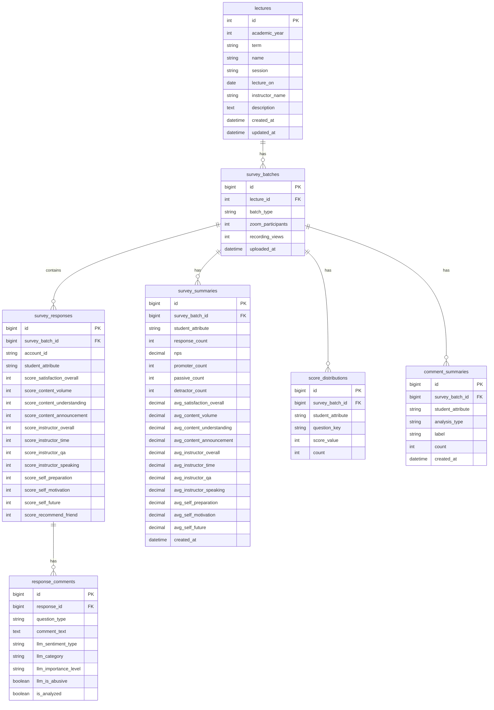

# データベーススキーマ

AIE-DXプロジェクトのデータベースは、以下の7つのテーブルで構成されています。

## ER図



## テーブル詳細

### 1. lectures (講義マスタ)

講義の基本情報を管理します。同一講義の重複登録を防ぐために複合ユニーク制約を設定しています。

| カラム名 | 型 | NULL | 説明 |
|---------|-----|------|------|
| id | INT | NO | 主キー（自動採番） |
| academic_year | INT | NO | 年度（例: 2024） |
| term | VARCHAR(50) | NO | 学期（例: 前期、後期） |
| name | VARCHAR(255) | NO | 講義名 |
| session | VARCHAR(50) | NO | セッション番号 |
| lecture_on | DATE | NO | 講義実施日 |
| instructor_name | VARCHAR(255) | NO | 講師名 |
| description | TEXT | YES | 講義説明 |
| created_at | DATETIME | NO | 作成日時 |
| updated_at | DATETIME | NO | 更新日時 |

**複合ユニーク制約**: `uq_lecture_composite` (academic_year, term, name, session, lecture_on)

### 2. survey_batches (アンケートバッチ)

アップロードされたCSVファイルごとのバッチ情報を管理します。

| カラム名 | 型 | NULL | 説明 |
|---------|-----|------|------|
| id | BIGINT | NO | 主キー（自動採番） |
| lecture_id | INT | NO | 講義ID（FK: lectures.id） |
| batch_type | VARCHAR(20) | NO | バッチ種別（'preliminary' or 'confirmed'） |
| zoom_participants | INT | YES | Zoom参加者数 |
| recording_views | INT | YES | 録画視聴回数 |
| uploaded_at | DATETIME | NO | アップロード日時（デフォルト: 現在時刻） |

**外部キー**: lecture_id → lectures.id

### 3. survey_responses (個別回答)

アンケート回答者ごとの12種類のスコアを保存します。

| カラム名 | 型 | NULL | 説明 |
|---------|-----|------|------|
| id | BIGINT | NO | 主キー（自動採番） |
| survey_batch_id | BIGINT | NO | バッチID（FK: survey_batches.id） |
| account_id | VARCHAR(255) | NO | 回答者ID |
| student_attribute | VARCHAR(50) | NO | 学生属性（例: 学部生、院生） |
| score_satisfaction_overall | INT | NO | 総合満足度（0-10） |
| score_content_volume | INT | NO | 内容の量（0-10） |
| score_content_understanding | INT | NO | 理解度（0-10） |
| score_content_announcement | INT | NO | 事前告知（0-10） |
| score_instructor_overall | INT | NO | 講師総合評価（0-10） |
| score_instructor_time | INT | NO | 時間管理（0-10） |
| score_instructor_qa | INT | NO | 質疑応答（0-10） |
| score_instructor_speaking | INT | NO | 話し方（0-10） |
| score_self_preparation | INT | NO | 自己準備（0-10） |
| score_self_motivation | INT | NO | 意欲（0-10） |
| score_self_future | INT | NO | 今後への活用（0-10） |
| score_recommend_friend | INT | NO | 友人推奨度（0-10、NPS計算用） |

**外部キー**: survey_batch_id → survey_batches.id

### 4. response_comments (コメント + LLM分析結果)

自由記述コメントとLLMによる分析結果を保存します。

| カラム名 | 型 | NULL | 説明 |
|---------|-----|------|------|
| id | BIGINT | NO | 主キー（自動採番） |
| response_id | BIGINT | NO | 回答ID（FK: survey_responses.id） |
| question_type | VARCHAR(50) | NO | 質問種別 |
| comment_text | TEXT | NO | コメント本文 |
| llm_sentiment_type | VARCHAR(20) | YES | 感情タイプ（positive/neutral/negative） |
| llm_category | VARCHAR(50) | YES | カテゴリ（instructor/operation/material/content/other） |
| llm_importance_level | VARCHAR(10) | YES | 重要度（high/medium/low） |
| llm_is_abusive | BOOLEAN | YES | 不適切判定フラグ（デフォルト: false） |
| is_analyzed | BOOLEAN | YES | 分析完了フラグ（デフォルト: false） |

**外部キー**: response_id → survey_responses.id

**LLM分析項目**:
- **sentiment_type**: コメントの感情（ポジティブ/ニュートラル/ネガティブ）
- **category**: コメントの分類（講師/運営/教材/内容/その他）
- **importance_level**: 改善優先度（高/中/低）
- **is_abusive**: 不適切な表現の有無

### 5. survey_summaries (集計サマリー)

学生属性ごとのNPSと平均スコアを集計します。

| カラム名 | 型 | NULL | 説明 |
|---------|-----|------|------|
| id | BIGINT | NO | 主キー（自動採番） |
| survey_batch_id | BIGINT | NO | バッチID（FK: survey_batches.id） |
| student_attribute | VARCHAR(50) | NO | 学生属性 |
| response_count | INT | NO | 回答数 |
| nps | DECIMAL(5,2) | YES | Net Promoter Score |
| promoter_count | INT | NO | 推奨者数（9-10点、デフォルト: 0） |
| passive_count | INT | NO | 中立者数（7-8点、デフォルト: 0） |
| detractor_count | INT | NO | 批判者数（0-6点、デフォルト: 0） |
| avg_satisfaction_overall | DECIMAL(3,2) | YES | 総合満足度平均 |
| avg_content_volume | DECIMAL(3,2) | YES | 内容の量平均 |
| avg_content_understanding | DECIMAL(3,2) | YES | 理解度平均 |
| avg_content_announcement | DECIMAL(3,2) | YES | 事前告知平均 |
| avg_instructor_overall | DECIMAL(3,2) | YES | 講師総合評価平均 |
| avg_instructor_time | DECIMAL(3,2) | YES | 時間管理平均 |
| avg_instructor_qa | DECIMAL(3,2) | YES | 質疑応答平均 |
| avg_instructor_speaking | DECIMAL(3,2) | YES | 話し方平均 |
| avg_self_preparation | DECIMAL(3,2) | YES | 自己準備平均 |
| avg_self_motivation | DECIMAL(3,2) | YES | 意欲平均 |
| avg_self_future | DECIMAL(3,2) | YES | 今後への活用平均 |
| created_at | DATETIME | NO | 作成日時（デフォルト: 現在時刻） |

**外部キー**: survey_batch_id → survey_batches.id

**NPS計算式**:
```
NPS = (推奨者数 - 批判者数) / 総回答数 × 100
```

### 6. score_distributions (スコア分布)

各質問のスコア分布を保存します（ヒストグラム表示用）。

| カラム名 | 型 | NULL | 説明 |
|---------|-----|------|------|
| id | BIGINT | NO | 主キー（自動採番） |
| survey_batch_id | BIGINT | NO | バッチID（FK: survey_batches.id） |
| student_attribute | VARCHAR(50) | NO | 学生属性 |
| question_key | VARCHAR(50) | NO | 質問キー（例: satisfaction_overall） |
| score_value | INT | NO | スコア値（0-10） |
| count | INT | NO | 該当回答数 |

**外部キー**: survey_batch_id → survey_batches.id

### 7. comment_summaries (コメント分類集計)

感情・カテゴリごとのコメント件数を集計します。

| カラム名 | 型 | NULL | 説明 |
|---------|-----|------|------|
| id | BIGINT | NO | 主キー（自動採番） |
| survey_batch_id | BIGINT | NO | バッチID（FK: survey_batches.id） |
| student_attribute | VARCHAR(50) | NO | 学生属性 |
| analysis_type | VARCHAR(20) | NO | 分析種別（sentiment/category） |
| label | VARCHAR(50) | NO | ラベル（positive/negative/instructor等） |
| count | INT | NO | 該当件数 |
| created_at | DATETIME | NO | 作成日時（デフォルト: 現在時刻） |

**外部キー**: survey_batch_id → survey_batches.id

## 命名規則

このスキーマは以下の命名規則に従っています（詳細は会話履歴を参照）：

- **テーブル名**: 複数形、スネークケース（例: `survey_batches`）
- **カラム名**: 単数形、スネークケース（例: `lecture_id`）
- **日付カラム**: `_on` サフィックス（例: `lecture_on`）
- **タイムスタンプカラム**: `_at` サフィックス（例: `created_at`）
- **Boolean カラム**: `is_` プレフィックス（例: `is_analyzed`）
- **区分値カラム**: `_type` サフィックス（例: `batch_type`, `sentiment_type`）
- **レベル系カラム**: `_level` サフィックス（例: `importance_level`）

## マイグレーション管理

このプロジェクトでは Alembic を使用してスキーマ変更を管理しています。

```bash
# マイグレーション生成
alembic revision --autogenerate -m "変更内容の説明"

# マイグレーション適用
alembic upgrade head

# ロールバック
alembic downgrade -1
```
