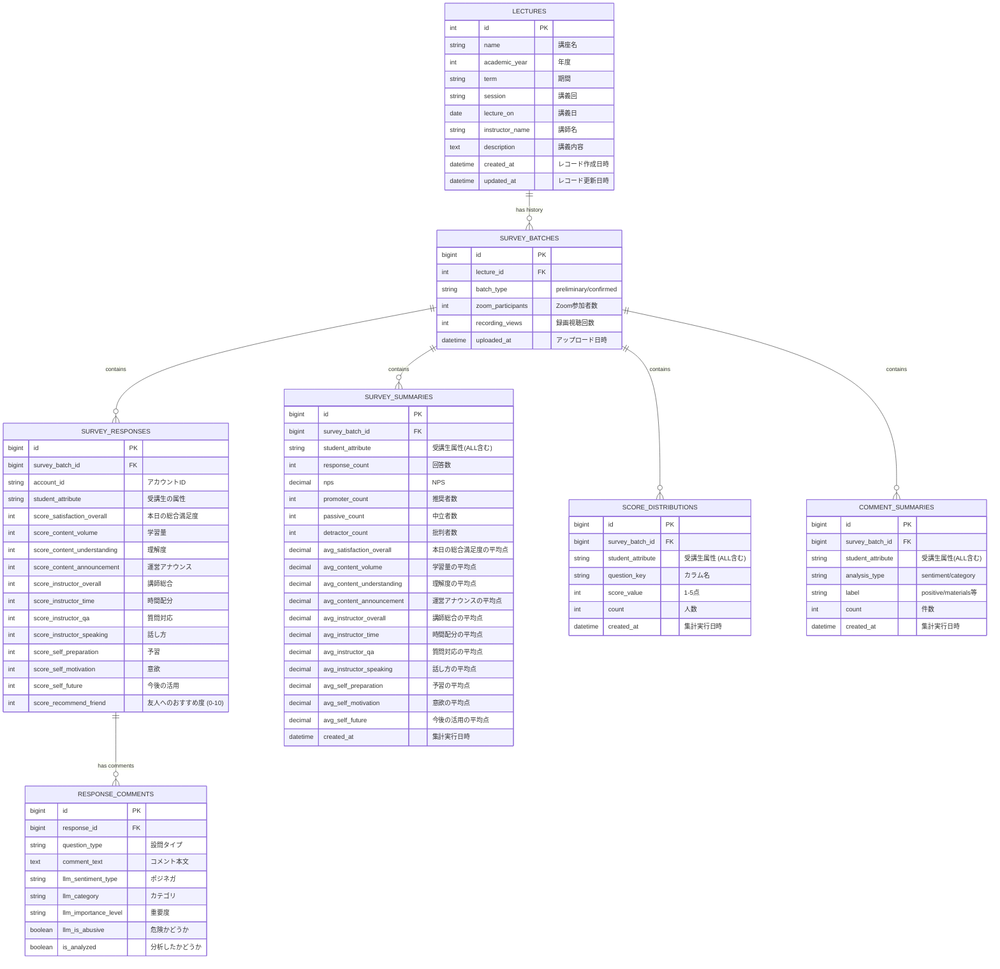

# ER図

# テーブル定義詳細

## `lectures` (講義マスタ)

講義そのものの定義。同じ講義のアップロード時に重複作成されないよう、複合ユニーク制約を設ける。

| **カラム名** | **データ型** | **制約** | **説明** |
| --- | --- | --- | --- |
| `id` | INT | PK, Auto Increment | 講義ID |
| `academic_year` | INT | Unique (複合) | 年度 (例: 2025) |
| `term` | VARCHAR(50) | Unique (複合) | 期間 (例: '9月-11月', '冬') |
| `name` | VARCHAR(255) | Unique (複合) | 講座名 |
| `session` | VARCHAR(50) | Unique (複合) | 講義回 (例: '第1回', ‘特別回’) |
| `lecture_on` | DATE | Unique (複合) | 講義の日付 |
| `instructor_name` | VARCHAR(255) | Not Null | 講師名 |
| `description` | TEXT | Nullable | 講義内容（シラバス概要） |
| `created_at` | DATETIME | Default Current | レコード作成日時 |
| `updated_at` | DATETIME | Default Current | レコード更新日時 |

## `survey_batches` (アンケート集計バッチ)

1回のExcelアップロードに対応する履歴テーブル。「速報版」と「確定版」は別レコードとして保存される。

| **カラム名** | **データ型** | **制約** | **説明** |
| --- | --- | --- | --- |
| `id` | BIGINT | PK, Auto Increment | バッチID |
| `lecture_id` | INT | FK (`lectures.id`) | 紐づく講義ID |
| `batch_type` | VARCHAR(20) | Not Null | `preliminary` (速報) / `confirmed` (確定) |
| `zoom_participants` | INT | Nullable | 速報版アップロード時のZoom参加者数 |
| `recording_views` | INT | Nullable | 確定版アップロード時の録画視聴回数 |
| `uploaded_at` | DATETIME | Default Current | アップロード日時 |

## `survey_responses` (アンケート回答・定量スコア)

個々の受講生のスコア部分の回答。`lecture_id` ではなく `survey_batch_id` に紐づく。

| **カラム名** | **データ型** | **制約** | **説明** |
| --- | --- | --- | --- |
| `id` | BIGINT | PK, Auto Increment | 回答ID |
| `survey_batch_id` | BIGINT | FK (`survey_batches.id`) | 紐づくバッチID |
| `account_id` | VARCHAR(255) | Not Null | アカウントID |
| `student_attribute`  | VARCHAR(50) | Not Null | 受講生の属性 (学生, 会員企業, 招待枠, 教員, その他) |
| `score_satisfaction_overall` | INT | Not Null | 本日の総合的な満足度 (1-5) |
| `score_content_volume` | INT | Not Null | 講義内容：学習量 (1-5) |
| `score_content_understanding` | INT | Not Null | 講義内容：理解度 (1-5) |
| `score_content_announcement` | INT | Not Null | 講義内容：運営アナウンス (1-5) |
| `score_instructor_overall` | INT | Not Null | 講師：総合的な満足度 (1-5) |
| `score_instructor_time` | INT | Not Null | 講師：授業時間の使い方 (1-5) |
| `score_instructor_qa` | INT | Not Null | 講師：質問対応 (1-5) |
| `score_instructor_speaking` | INT | Not Null | 講師：話し方 (1-5) |
| `score_self_preparation` | INT | Not Null | 自身：事前の予習 (1-5) |
| `score_self_motivation` | INT | Not Null | 自身：意欲 (1-5) |
| `score_self_future` | INT | Not Null | 自身：今後の活用 (1-5) |
| `score_recommend_friend` | INT | Not Null | 友人へのおすすめ度 (0-10) |

## `response_comments` (自由記述・LLM分析結果)

自由記述部分を正規化して格納する。LLM分析結果のカラムも含む。

| **カラム名** | **データ型** | **制約** | **説明** |
| --- | --- | --- | --- |
| `id` | BIGINT | PK, Auto Increment | コメントID |
| `response_id` | BIGINT | FK (`survey_responses.id`) | 紐づく回答ID |
| `question_type` | VARCHAR(50) | Not Null | 設問タイプ (※定義値は下記参照) |
| `comment_text` | TEXT | Not Null | コメント本文 |
| `llm_sentiment_type` | VARCHAR(20) | Nullable | `positive`, `neutral`, `negative` |
| `llm_category` | VARCHAR(50) | Nullable | `content`, `material`, `instructor`, `operation`, `other` |
| `llm_importance_level` | VARCHAR(10) | Nullable | `high`, `medium`, `low` |
| `llm_is_abusive` | BOOLEAN | Default FALSE | 誹謗中傷や攻撃的な発言など危険かどうかのフラグ |
| `is_analyzed` | BOOLEAN | Default FALSE | LLM分析済みかどうかのフラグ（あると便利） |

**※ `question_type` の定義値（ENUMまたはアプリ定数として管理）**

- `learned`: 本日の講義で学んだこと（LLM分析対象外）
- `good_points`: 本日の講義で特に良かった部分
- `improvements`: わかりにくかった部分や改善点
- `instructor_feedback`: 講師について、良かった点や不満点
- `future_requests`: 今後開講してほしい講義・分野
- `free_comment`: 自由意見

**LLM分析の実行タイミング**

- データインポート時は `llm_...` カラムは `NULL`、`is_analyzed` は `FALSE` で保存する。
- 非同期ジョブで `WHERE is_analyzed = FALSE AND question_type != 'learned'` のレコードを取得し、LLM APIへ投げる設計にすると、アップロード処理が重くならない。

## `survey_summaries` (基本指標・平均点集計)

各講義回（バッチ）ごとの、回答数、NPS、および全スコア項目の平均値を保持する。

| **カラム名** | **データ型** | **制約** | **説明** |
| --- | --- | --- | --- |
| `id` | BIGINT | PK, Auto Inc | 集計ID |
| `survey_batch_id` | BIGINT | FK | `survey_batches.id` への外部キー |
| `student_attribute` | VARCHAR(50) | Not Null | 属性（'ALL', '学生', '教員' など） |
| `response_count` | INT | Not Null | その属性における回答総数 |
| `nps` | DECIMAL(5,2) | Nullable | NPS (-100.00 〜 100.00) |
| `promoter_count` | INT | Default 0 | 推奨者数 (9-10点) |
| `passive_count` | INT | Default 0 | 中立者数 (7-8点) |
| `detractor_count` | INT | Default 0 | 批判者数 (0-6点) |
| `avg_satisfaction_overall` | DECIMAL(3,2) | Nullable | 本日の総合満足度の平均 |
| `avg_content_volume` | DECIMAL(3,2) | Nullable | 学習量の平均 |
| `avg_content_understanding` | DECIMAL(3,2) | Nullable | 理解度の平均 |
| `avg_content_announcement` | DECIMAL(3,2) | Nullable | 運営アナウンスの平均 |
| `avg_instructor_overall` | DECIMAL(3,2) | Nullable | 講師総合の平均 |
| `avg_instructor_time` | DECIMAL(3,2) | Nullable | 時間配分の平均 |
| `avg_instructor_qa` | DECIMAL(3,2) | Nullable | 質問対応の平均 |
| `avg_instructor_speaking` | DECIMAL(3,2) | Nullable | 話し方の平均 |
| `avg_self_preparation` | DECIMAL(3,2) | Nullable | 予習の平均 |
| `avg_self_motivation` | DECIMAL(3,2) | Nullable | 意欲の平均 |
| `avg_self_future` | DECIMAL(3,2) | Nullable | 今後の活用の平均 |
| `created_at` | DATETIME | Default Current | 集計実行日時 |

## `score_distributions` (スコア分布・ヒストグラム用)

「選択した講義回の全質問項目の分布（1-5点の各人数）」を表示するために、設問ごとに1〜5点の人数を縦持ちで保存する。

| **カラム名** | **データ型** | **制約** | **説明** |
| --- | --- | --- | --- |
| `id` | BIGINT | PK, Auto Inc | 分布ID |
| `survey_batch_id` | BIGINT | FK | `survey_batches.id` への外部キー |
| `student_attribute` | VARCHAR(50) | Not Null | 属性（'ALL' 含む） |
| `question_key` | VARCHAR(50) | Not Null | 対象のカラム名 (例: `score_content_understanding`) |
| `score_value` | INT | Not Null | 点数 (1, 2, 3, 4, 5) |
| `count` | INT | Not Null | その点数をつけた人数 |
| `created_at` | DATETIME | Default Current | 集計実行日時 |

**データの格納イメージ:**

| **id** | **survey_batch_id** | **student_attribute** | **question_key** | **score_value** | **count** |
| --- | --- | --- | --- | --- | --- |
| 1 | 101 | ALL | score_content_understanding | 5 | 30 |
| 2 | 101 | ALL | score_content_understanding | 4 | 12 |
| 3 | 101 | ALL | score_content_understanding | 3 | 2 |
| 4 | 101 | ALL | score_satisfaction_overall | 5 | 25 |
| 5 | 101 | ALL | score_satisfaction_overall | 4 | 15 |
| ... | ... | ... | ... | ... | ... |

## `comment_summaries` (コメント分析集計)

LLMによる分析結果（感情・カテゴリ・重要度）を集計する。

| **カラム名** | **データ型** | **制約** | **説明** |
| --- | --- | --- | --- |
| `id` | BIGINT | PK, Auto Inc | コメント集計ID |
| `survey_batch_id` | BIGINT | FK | `survey_batches.id` への外部キー |
| `student_attribute` | VARCHAR(50) | Not Null | 属性（'ALL' 含む） |
| `analysis_type` | VARCHAR(20) | Not Null | 集計タイプ (`sentiment`, `category`, `importance`) |
| `label` | VARCHAR(50) | Not Null | 値 (例: `positive`, `material`, `high`) |
| `count` | INT | Not Null | 該当するコメント数 |
| `created_at` | DATETIME | Default Current | 集計実行日時 |

**データの格納イメージ:**

| **id** | **survey_batch_id** | **student_attribute** | **analysis_type** | **label** | **count** |
| --- | --- | --- | --- | --- | --- |
| 1 | 101 | ALL | sentiment | positive | 45 |
| 2 | 101 | ALL | sentiment | negative | 3 |
| 3 | 101 | ALL | sentiment | neutral | 10 |
| 4 | 101 | ALL | category | content | 20 |
| 5 | 101 | ALL | category | material | 5 |
| 6 | 101 | ALL | category | operation | 8 |
| 7 | 101 | ALL | category | other | 2 |
| 8 | 101 | ALL | importance | high | 12 |
| 9 | 101 | ALL | importance | medium | 15 |
| 10 | 101 | ALL | importance | low | 8 |

# 講義全体を通しての集計

- すでに作成した集計テーブル（`survey_summaries`）から、バックエンド側で瞬時に計算可能。
- フロントエンドから「講座名・年度・期間・速報版/確定版・受講生の属性」を指定されたとして、その講義全体の加重平均を算出する。
    
    $$
    \frac{\sum (\text{各回の平均点} \times \text{各回の回答数})}{\sum (\text{各回の回答数})}

