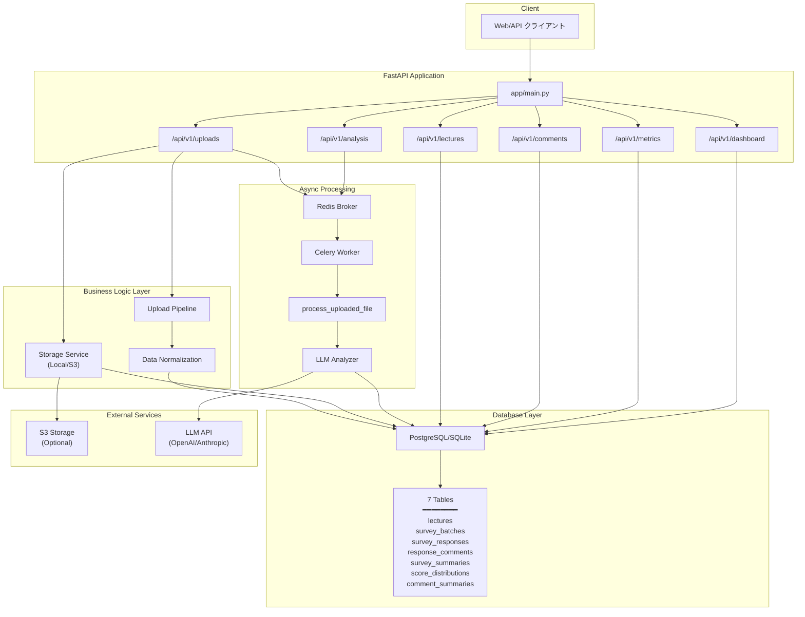

# データフロー

CSVアップロードから結果参照までのデータフローと処理詳細を説明します。

## システムアーキテクチャ図



## 処理フロー詳細

### 1. CSVアップロード

**エンドポイント**: `POST /api/v1/uploads`

クライアントがCSVファイルとメタデータを送信します。

**送信データ**:
- CSVファイル
- 講義情報（年度、学期、講義名、セッション、講義日、講師名）
- バッチタイプ（preliminary/confirmed）
- オプション情報（Zoom参加者数、録画視聴回数）

### 2. ファイル保存

**Storage Service** (`app/services/storage.py`)

- ローカルストレージまたはS3にCSVファイルを保存
- ファイルパスをデータベースに記録（将来的に`survey_batches`に `file_path` カラム追加予定）

### 3. データ正規化

**Upload Pipeline** (`app/services/upload_pipeline.py`)

#### 3.1 Lecture の取得または作成

```python
# 複合ユニーク制約で重複チェック
lecture = get_or_create_lecture(
    academic_year=2024,
    term="前期",
    name="データサイエンス入門",
    session="第1回",
    lecture_on="2024-04-10",
    instructor_name="山田太郎"
)
```

**テーブル**: `lectures`

#### 3.2 SurveyBatch の作成

```python
survey_batch = create_survey_batch(
    lecture_id=lecture.id,
    batch_type="preliminary",
    zoom_participants=50,
    recording_views=120
)
```

**テーブル**: `survey_batches`

#### 3.3 SurveyResponse の作成

CSVの各行を `SurveyResponse` レコードとして保存。

```python
for row in csv_rows:
    survey_response = create_survey_response(
        survey_batch_id=survey_batch.id,
        account_id=row['account_id'],
        student_attribute=row['student_attribute'],
        score_satisfaction_overall=row['Q1'],
        score_content_volume=row['Q2'],
        # ... 12種類のスコア
        score_recommend_friend=row['Q12']
    )
```

**テーブル**: `survey_responses`

#### 3.4 ResponseComment の作成

自由記述コメント列を `ResponseComment` レコードとして保存。

```python
for comment_column in ['good_point', 'improvement_point', 'free_comment']:
    if row[comment_column]:
        create_response_comment(
            response_id=survey_response.id,
            question_type=comment_column,
            comment_text=row[comment_column]
        )
```

**テーブル**: `response_comments`

### 4. 非同期分析のキュー投入

**Celery Task** (`app/workers/tasks.py`)

アップロード完了後、Celeryタスク `process_uploaded_file` をRedisキューに投入。

```python
task = process_uploaded_file.delay(survey_batch_id=survey_batch.id)
```

**即座にレスポンス**:
```json
{
  "upload_id": 123,
  "message": "Upload successful",
  "status": "processing"
}
```

### 5. LLM分析（バックグラウンド）

**LLM Analyzer** (`app/analysis/comment_analyzer.py`)

Celeryワーカーが各コメントをLLM APIに送信して分析。

#### 5.1 感情分析

```python
llm_sentiment_type = analyze_sentiment(comment_text)
# 結果: "positive" / "neutral" / "negative"
```

#### 5.2 カテゴリ分類

```python
llm_category = categorize_comment(comment_text)
# 結果: "instructor" / "operation" / "material" / "content" / "other"
```

#### 5.3 重要度評価

```python
llm_importance_level = evaluate_importance(comment_text)
# 結果: "high" / "medium" / "low"
```

#### 5.4 不適切判定

```python
llm_is_abusive = detect_abusive(comment_text)
# 結果: True / False
```

#### 5.5 結果をDBに保存

```python
update_comment_analysis(
    comment_id=comment.id,
    llm_sentiment_type=llm_sentiment_type,
    llm_category=llm_category,
    llm_importance_level=llm_importance_level,
    llm_is_abusive=llm_is_abusive,
    is_analyzed=True
)
```

**更新テーブル**: `response_comments`

### 6. 集計処理

全コメントの分析完了後、集計テーブルを更新。

#### 6.1 SurveySummary の作成

学生属性ごとにNPSと平均スコアを計算。

```python
# NPS計算
promoters = count(score_recommend_friend >= 9)
passives = count(7 <= score_recommend_friend <= 8)
detractors = count(score_recommend_friend <= 6)
nps = (promoters - detractors) / total * 100

# 平均スコア計算
avg_satisfaction_overall = mean(score_satisfaction_overall)
# ... 各スコアの平均
```

**作成テーブル**: `survey_summaries`

#### 6.2 ScoreDistribution の作成

各質問のスコア分布を集計（ヒストグラム用）。

```python
for question_key in SCORE_QUESTIONS:
    for score_value in range(0, 11):
        count = count_responses(question_key, score_value, student_attribute)
        create_score_distribution(
            survey_batch_id=batch.id,
            student_attribute=attr,
            question_key=question_key,
            score_value=score_value,
            count=count
        )
```

**作成テーブル**: `score_distributions`

#### 6.3 CommentSummary の作成

感情・カテゴリごとのコメント件数を集計。

```python
# 感情別集計
for sentiment in ['positive', 'neutral', 'negative']:
    count = count_comments(sentiment_type=sentiment, student_attribute=attr)
    create_comment_summary(
        survey_batch_id=batch.id,
        student_attribute=attr,
        analysis_type='sentiment',
        label=sentiment,
        count=count
    )

# カテゴリ別集計
for category in ['instructor', 'operation', 'material', 'content', 'other']:
    count = count_comments(category=category, student_attribute=attr)
    create_comment_summary(
        survey_batch_id=batch.id,
        student_attribute=attr,
        analysis_type='category',
        label=category,
        count=count
    )
```

**作成テーブル**: `comment_summaries`

### 7. 結果取得

クライアントが各APIエンドポイントでデータを取得。

#### 講義一覧
`GET /api/v1/lectures` → `lectures` テーブル

#### コメント一覧
`GET /api/v1/comments` → `response_comments` テーブル（LLM分析結果含む）

#### メトリクス
`GET /api/v1/metrics` → `survey_summaries`, `score_distributions`, `comment_summaries`

#### ダッシュボード
`GET /api/v1/dashboard` → 複数テーブルを統合したデータ

## エラーハンドリング

### アップロード時のエラー

- **CSV形式エラー**: 必須カラムの欠落、データ型不一致 → 400 Bad Request
- **重複エラー**: 同じ講義情報で既にバッチが存在 → 409 Conflict

### LLM分析時のエラー

- **API エラー**: リトライ処理（最大3回）
- **タイムアウト**: 60秒でタイムアウト、エラーログ記録
- **レート制限**: 指数バックオフでリトライ

## パフォーマンス最適化

### バッチ処理

- コメント分析はバッチ単位で並列実行（最大10並列）
- DB書き込みはバルクインサートを使用

### キャッシング

- 講義情報はRedisにキャッシュ（TTL: 1時間）
- 集計結果もキャッシュ（TTL: 30分）

### インデックス

- `survey_batch_id` にインデックス（全子テーブル）
- `lecture_id` にインデックス
- `is_analyzed` にインデックス（未分析コメント検索用）

## 関連ドキュメント

- [データベーススキーマ詳細](database.md)
- [API エンドポイント一覧](api.md)
- [開発ガイド](development.md)

