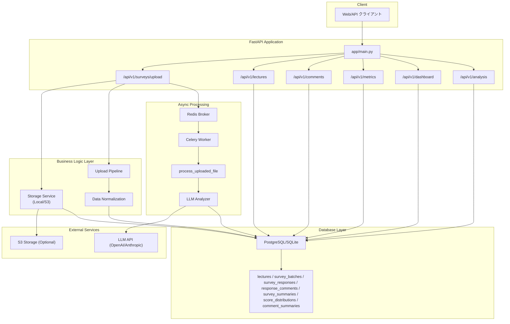

# データフロー

CSVアップロードからダッシュボード参照までのフローを、重複説明なしで整理しています。

## システム構成



## 処理ステージ

### 1. CSVアップロード（API層）
- `POST /api/v1/surveys/upload` がCSVとメタデータ（`course_name`, `lecture_on`, `lecture_number`, 任意で `lecture_id`/`uploader_id`）を受信。
- 重複検知は `GET /api/v1/surveys/batches/search` をクライアント側で先に叩く運用。本体は常に受理し、即座に非同期処理へ移行。

```json
{
  "survey_batch_id": 123,
  "status_url": "/api/v1/jobs/123",
  "message": "Upload accepted. Analysis will run in the background."
}
```

> 年度・学期・講師名は必須ではなく、欠損時は `_derive_academic_year()` が年度を推測し、未知の値は `"Unknown"` / `"TBD"` で補完します。

### 2. ファイル保存とエンティティ作成（Service層）
- `app/services/storage.py` がCSVをローカルまたはS3へ保存し、`local://` or `s3://` URIを返却。URIはタスク投入時に渡すだけでDB保存はしない。
- `app/api/upload.py` で `Lecture` を検索 or 新規作成。`metadata.lecture_id` があれば再利用、なければ講義名+日付+回次で探索し、無ければ `term="Unknown"`, `instructor_name="TBD"` をセットして作成。
- `SurveyBatch` を `batch_type="preliminary"` で1件生成し、IDをレスポンスおよびタスクIDとして使用。

### 3. 非同期タスク投入（API→Worker）
- APIは `process_uploaded_file.delay(batch_id, s3_key)` を即時実行し、以降の処理はCeleryワーカーに委譲。
- 進捗テーブルは存在せず、`SurveySummary` の有無で完了判定。`GET /api/v1/jobs/{job_id}` はDB照会だけで応答。

### 4. Upload Pipeline（Worker内）
すべて `process_uploaded_file` タスクで完結し、HTTPリクエストは既に応答済みです。

#### 4.1 SurveyBatch取得とCSVロード
- ワーカーは `survey_batch_id` とストレージURIを受け取り、既存 `Lecture`/`SurveyBatch` を再参照。
- URI経由でCSV本体をダウンロードし、`analyze_and_store_comments()` に渡す。

```python
survey_batch = (
    db.query(SurveyBatch)
    .options(joinedload(SurveyBatch.lecture))
    .filter(SurveyBatch.id == batch_id)
    .first()
)
if not survey_batch:
    raise RuntimeError(f"Batch {batch_id} not found")

content_bytes = storage_client.load(s3_key)
_ = analyze_and_store_comments(
    db=db,
    survey_batch=survey_batch,
    content_bytes=content_bytes,
)
```

#### 4.2 SurveyResponse生成
- `score_column_map` で列→モデル属性を定義し、各行を `SurveyResponse` に変換。
- 12種のスコア列は `nullable=False`。空文字や非数値が含まれると `IntegrityError` でロールバックされるため、CSVは0-10/1-5の数値のみ許容。

#### 4.3 ResponseComment生成
- `（任意）` / `【必須】` で始まる自由記述列を抽出し、`ResponseComment` を作成。
- `（任意）` 列のみ `analyze_comment()` でLLM解析を実施し、感情・カテゴリ・重要度・リスクを `llm_*` カラムへ保存。解析は即時完了し、`analysis_version="preliminary"` を付与。

### 5. LLM分析
- `app/analysis/analyzer.py` が sentiment / category / importance / risk を個別API呼び出しで取得し、スタブ含めて統合。
- `ResponseComment` 作成時点で `llm_category`, `llm_sentiment_type`, `llm_importance_level`, `llm_is_abusive` を確定させるため、後続の更新処理は不要。

### 6. 集計
コメント解析完了後に3種の集計テーブルを更新します。

- **SurveySummary** (`survey_summaries`): 学生属性ごとのNPSと平均スコアを算出し、`avg_*` と `nps` カラムへ保存。
- **ScoreDistribution** (`score_distributions`): 各質問の観測スコア値を `GROUP BY` でまとめ、ヒストグラム用データを生成。
- **CommentSummary** (`comment_summaries`): 感情/カテゴリ/重要度別の件数を保持。重要コメントは `importance_medium + importance_high` を合算して再利用。

### 7. 結果取得（API層）
- **講義一覧** `GET /api/v1/courses` → `lectures` テーブル。講座名・年度・期間でグルーピングして返却。
- **コメント一覧** `GET /api/v1/courses/{course_name}/comments` → `response_comments`。`version` クエリで preliminary/final を切替。
- **メトリクス** `GET/PUT /api/v1/uploads/{survey_batch_id}/metrics` および `GET/PUT /api/v1/lectures/{lecture_id}/metrics` → `survey_batches.zoom_participants` / `recording_views` を管理。
- **ダッシュボード** `GET /api/v1/dashboard/*` → `Lecture` と `SurveySummary` を集計して返却。
- **ステータス** `GET /api/v1/jobs/{job_id}` → `SurveySummary` 有無と `ResponseComment` 件数で完了判定する設計だが、欠落カラム参照のため未修復。

## 既知の課題

1. **ステータスAPIのAttributeError**: `ResponseComment.survey_batch_id` が存在しないため、`SurveyResponse` とのJOINまたはカラム再導入が必須。
2. **集計スキーマとの不整合**: `app/services/summary.py` が削除済み `score_*` カラムへ `setattr` しており、`avg_*` へ保存されない。
3. **講義/コースAPIのフィールド不一致**: `Lecture.course_name` 等の不存在カラムを参照。削除処理でも `SurveyBatch.status` や `ResponseComment.survey_batch_id` を想定しており、JOIN見直しが必要。
5. **削除フロー未完成**: アップロード/講義削除ともに `ResponseComment` のカスケードが機能せず、`analysis_version` 条件も未整理。

## エラーハンドリング

- **アップロード**: CSV必須カラム欠如や型不一致で400。重複は `check-duplicate` で事前確認する運用。
- **LLM分析**: API失敗・レート制限・HTTPXタイムアウトは警告ログを残して当該コメントをスキップ（retry/backoff未実装）。

## パフォーマンス

- CSV1件につきCeleryタスク1件。並列度はワーカー数/キュー設定に依存。
- DB挿入は1行ずつ `SurveyResponse` を追加し `db.flush()` でIDを確定（バルク未対応）。
- 過去に存在した `survey_batch_id` / `lecture_id` / `is_analyzed` のインデックスは削除済み。必要ならAlembicで再追加するかビューで代替。

## 関連ドキュメント

- [データベーススキーマ詳細](database.md)
- [API エンドポイント一覧](api.md)
- [開発ガイド](development.md)
