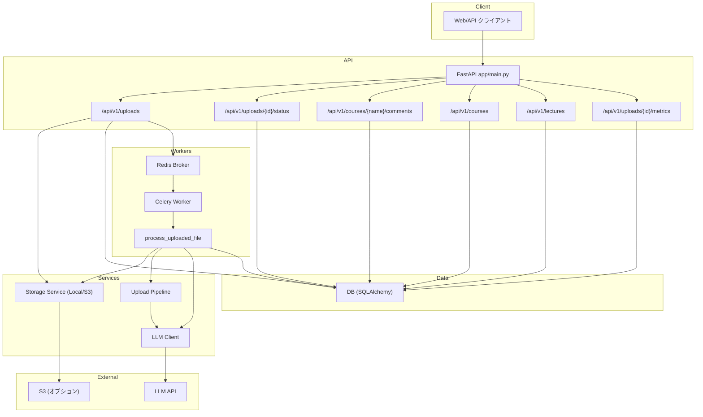

# データフロー（バックエンド概要）

CSVアップロードから結果参照までの流れをMermaidで示します。

```mermaid
graph TB
    subgraph Client
        Web["Web/API クライアント"]
    end

    subgraph API
        FastAPI["FastAPI app/main.py"]
        Upload["/api/v1/uploads"]
        Status["/api/v1/uploads/{id}/status"]
        Comments["/api/v1/courses/{name}/comments"]
        Courses["/api/v1/courses"]
        Lectures["/api/v1/lectures"]
        Metrics["/api/v1/uploads/{id}/metrics"]
    end

    subgraph Services
        Storage["Storage Service (Local/S3)"]
        LLM["LLM Client"]
        Pipeline["Upload Pipeline"]
    end

    subgraph Workers
        Celery["Celery Worker"]
        Redis["Redis Broker"]
        Task["process_uploaded_file"]
    end

    subgraph Data
        DB["DB (SQLAlchemy)"]
    end

    subgraph External
        S3["S3 (オプション)"]
        LLMAPI["LLM API"]
    end

    Web --> FastAPI
    FastAPI --> Upload
    FastAPI --> Status
    FastAPI --> Comments
    FastAPI --> Courses
    FastAPI --> Lectures
    FastAPI --> Metrics

    Upload --> Storage
    Upload --> DB
    Upload --> Redis

    Status --> DB
    Comments --> DB
    Courses --> DB
    Lectures --> DB
    Metrics --> DB

    Redis --> Celery
    Celery --> Task
    Task --> Storage
    Task --> Pipeline
    Task --> LLM
    Task --> DB

    Pipeline --> LLM
    Storage --> S3
    LLM --> LLMAPI
```
